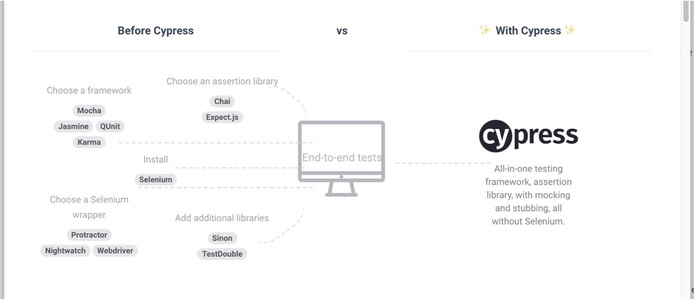

<!SLIDE center>
         
# Introduction to Cypress

         

<!SLIDE>
# What is Cypress?
- Tool which simulates browser actions like a real user 
- Provides an easy way for Developers and QAs to write tests 
- Testing tool written in JavaScript
- Great alternative to Selenium
- Includes a UI test runner (open source) and a dashboard service (paid) to access recorded tests
- Not just a tool for E2E tests but can also be used for unit and integration testing
- Debugging made easy – access to dev tools and obvious error messages (no more long stack trace errors)
- Only supports Chrome at the moment (Including Canary, Chromium and Electron)
- Doesn’t support xPath selectors

~~~SECTION:notes~~~

Created by Brian Mann to help developers write automation tests from a user’s perspective

Any actions that users can do can be simulated such as clicking a button, typing values on forms, selecting checkboxes.

More and more companies are introducing Cypress in their development workflow. As of now, there are more than 240,000 weekly downloads

~~~ENDSECTION~~~

<!SLIDE>
# Installation and Setup
- yarn `yarn add cypress --dev`
- npm `npm i -g cypress`

A very simple Cypress test

<pre><code>
  it('should click on the image gallery', () => {
    cy.get(':nth-child(2) > .tile-viewport > img')
      .click();

    cy.get('.footerCaption_2r5qf')
      .should('be.visible')
      .should('have.text', 'Dog in the Park - Marie Cruz');
  });
</code></pre>

<!SLIDE>
# How is Cypress different?

 
