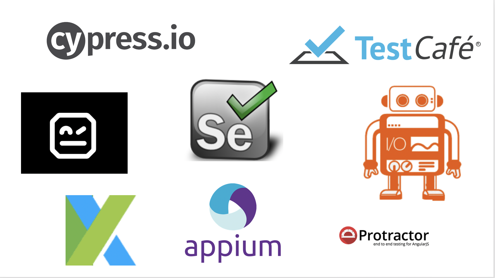

<!SLIDE>
# Functional Testing Frameworks

 

~~~SECTION:notes~~~
Popular ones include:

Katalon Studio - tool for API, web and mobile testing. Targets testers with limited programming knowledge.

Cypress.io - tool mainly used for functional but can also be use to write integration tests using the request method.

Selenium - most popular tool, can be portable to use with any programming languages

Robot - uses keyword base driven when writing the tests

Testcafe - quite similar with cypress but can be run against different browsers

~~~ENDSECTION~~~