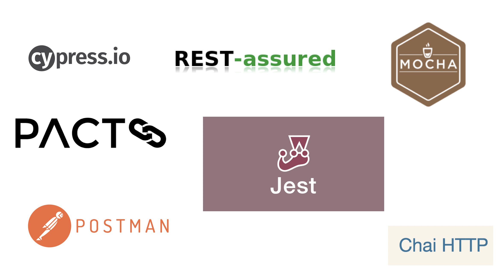

<!SLIDE>
# Integration Testing Frameworks

Unit testing frameworks can also be used for integration testing (when you are testing with mock data).

 

~~~SECTION:notes~~~
Popular ones include:

Cypress.io - tool mainly used for functional but can also be use to write integration tests using the request method.

Rest-Assured - Java based API framework and works well with gherkin syntax.

Pact - Contract based testing. Aims to validate if the contract is valid between a consumer and a provider. Useful for testing microservices.

Postman - API testing tool

~~~ENDSECTION~~~