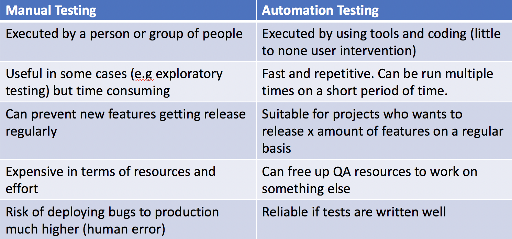

<!SLIDE>
# Manual vs Automation Tests

~~~SECTION:notes~~~

Explain that Manual Testing is NOT BAD. Just too much manual testing is bad as it's a waste of time.

The aim of manual testing ideally is to find bugs not caught by the automation (e.g. Exploratory testing bugs)

Automation tests should complement manual tests.

~~~ENDSECTION~~~