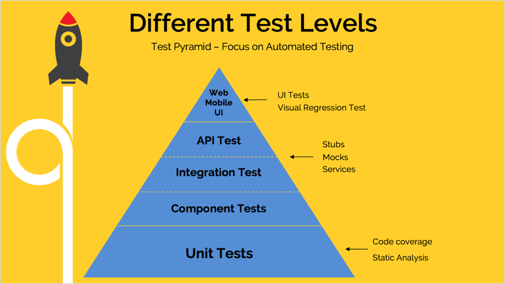

<!SLIDE center>
         
# Test Automation Strategy

         

<!SLIDE>
# Test Pyramid

- The higher we go up the pyramid, the slower the tests are and the more expensive they get to execute.
- Exploratory testing on top of the pyramid for any scenarios not covered by test automation.

~~~SECTION:notes~~~

The lower we are on the pyramid, the more isolated our tests are and less dependent.

UI tests are commonly seen as flaky tests because of external services timing out.

Ideally, the ratio should be 70% Unit tests, 20% Integration tests, 10% UI tests

~~~ENDSECTION~~~