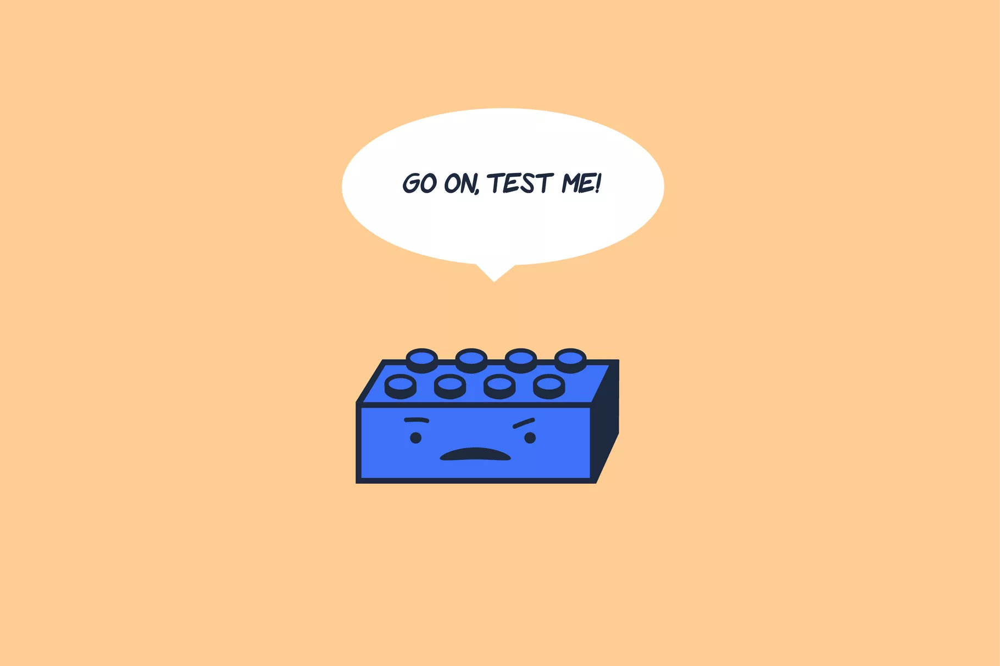

<!SLIDE center>
         
# Unit Testing

         

<!SLIDE>
# Unit Testing
 - Testing to see if our methods or block of code work in isolation
 - Promotes trust that our program will do as intended
 - Helps us think different edge cases scenarios
 - Fast to execute (takes milliseconds) since we will mock any external functions

 

 ~~~SECTION:notes~~~

Lego analogy. 

Each lego pieces need to have the correct stud so it can fit with other lego parts.

It's the same with unit tests, we need to make sure that our component works in isolation so we have trust that it can connect to other components fine.

~~~ENDSECTION~~~