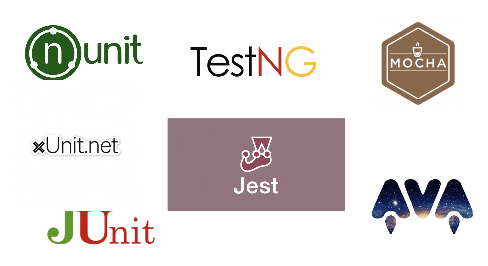

<!SLIDE>
# Unit Testing Frameworks

 

~~~SECTION:notes~~~
Popular ones include:

Jest - JS unit testing framework. Jest is a framework created by Facebook. De facto framework for React applications. Comes built in with mocking and assertion libraries.

Mocha - Another JS test framework. Flexible test framework which allows you to select which assertion, mocking libraries to use. More setup required than Jest.

Ava - Another JS test framework, lets you run tests concurrently

Junit - Java Unit framework

TestNG - Java framework based on JUnit but provides more feature

nUnit & xUnit - frameworks for .net

~~~ENDSECTION~~~