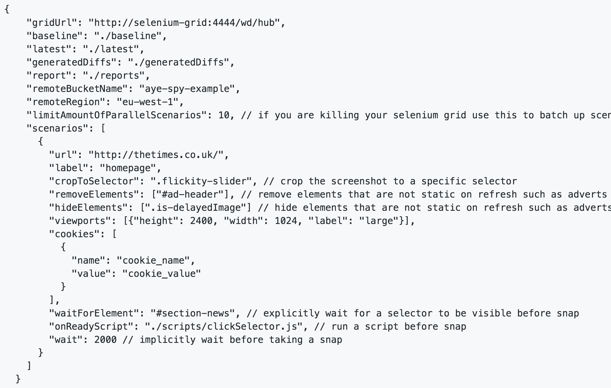

<!SLIDE center>
         
# Introduction to AyeSpy

         

<!SLIDE>
# What is AyeSpy?
- Testing framework created by Times Tooling Team which does image comparison over time
- Takes a baseline image and compares it with a set of new test images as you make changes to your application.
- Any differences will be reported as it does pixel by pixel comparison
- Supports real browsers via Selenium Grid instance
- Images are stored on AWS S3

<!SLIDE>
# Installation and Setup
- yarn `yarn add --dev aye-spy`
- npm `npm install --save-dev aye-spy`

<!SLIDE>
An example config file for AyeSpy:

 
