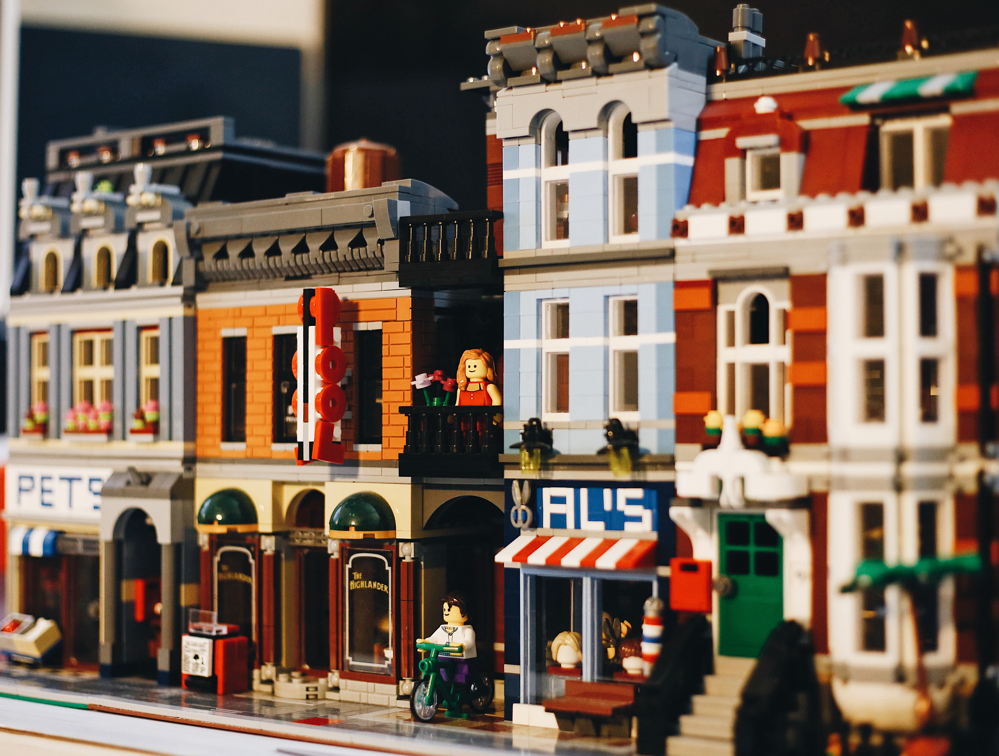

<!SLIDE center>
         
# Visual Testing

         

<!SLIDE>
# Visual Testing
 - Testing the visual look of our application
 - Most of the bugs we find in production are visual bugs
 - Can be a powerful test approach when implemented correctly
 - Page must be as static as possible

 

~~~SECTION:notes~~~

Lego analogy. 

Are the legos in the correct colours? the correct length?

Are the legos what the users visually wants?

~~~ENDSECTION~~~

<!SLIDE>
# Why do Visual Testing?
  - Isn't functional testing enough?
  - Using assertions like is element visible not enough
  - The actual positioning, size, colour needs to be validated
