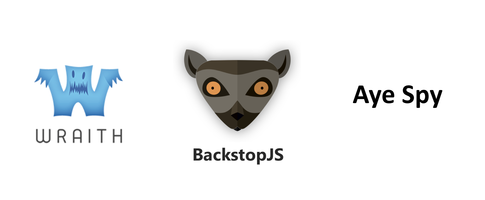

<!SLIDE>
# Visual Testing Frameworks

~~~SECTION:notes~~~
Popular ones include:

Wraith - Created by BBC, only supports headless browsers (PhantomJS which is now suspended and SlimerJS)

Backstop - Most popular tool, supports Chromy and Puppeteer but can be flaky.

AyeSpy - Created by the Times Tooling team. Runs against real browsers via Selenium Grid

~~~ENDSECTION~~~